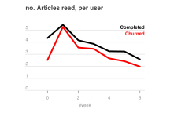
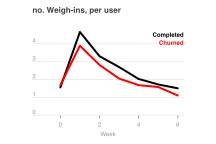
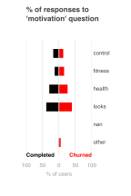
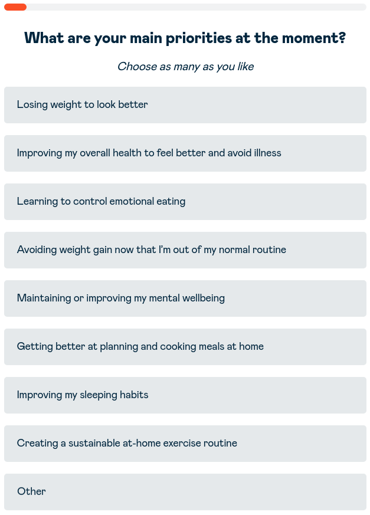
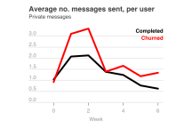
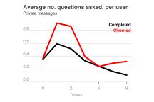
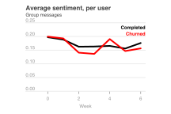
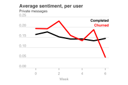

# Can we anticipate churn?

## Introduction

Within Second Nature, we can define churn as the 'percentage of users that *do not* complete the 12 week programme'. At present, the churn rate during the second half of the core programme, is 0.9%. Undoubtedly users will have different reasons for leaving the programme. However, if there are any common patterns between users who churn, they may be identifiable through the users' data.

In order to reduce churn, it would be beneficial to identify factors that might preemptively identify users that are likely to quit programme, allowing us to take steps to retain the user. Here, I outline quantifiable indicators that might help us predict churn.

## Data background

The data used for these analyses cover the first six week of the core programme for 428 users - 390 of which completed the programme and 38 who left. This data encompasses the activity of users, with a focus on their messaging behaviour, but also any activities/events they've logged through the app. With these metrics, I've sought to identify any significant differences in behaviour between users who churn and those who do not.

## Engagement analysis

The relative *engagement* of our users in the programme can be interpreted by looking at the number of events they log each week. These include metrics like how many food diary entries they've added, how many recipes they've saved, etc. 

Interestingly, users who churn after the six week mark show, on average, lower engagement in two specific activities: the number of articles they read, and the number of times they weigh-in. This difference is noticeable even at the earliest time point (week 0), prior to the user's official start date. 

It would be reasonable to assume that a user's engagement in the programme might be linked to their motivation for joining. However, comparing the answers given to the 'motivation' question on sign up, there was no difference over which options were chosen between users who churned and those who did not. For example, from the chart below, the percentage of people who listed their main motivation as 'losing weight to look better' ('looks' category) is indiscernible between users who churned (red), and those who did not (black). 

  

In order to understand why engagement is lower among churners, it would be useful to investigate why churners are reading fewer articles the users who complete the programme. It could be the case that they aren't getting as much exposure to the material as other users, contributing to a loss motivation/interest in the programme. As such it, it would be worth knowing how users prefer to access articles (app, website, email), to try and boost user exposure to the material.

Similarly, it would be interesting to work out if the difference in weigh-ins correlates with subscription to the 'tech programme' (which includes the auto-syncing bluetooth scales). If we assume that owning auto-sync scales increases the likelihood of a user weighing-in, those on the 'no tech' programme may be more likely to churn, given that fewer weigh-ins correlates with churn.

## Communication analysis

Another feature that distinguishes users who churn is their pattern of communication in private message with their mentor. Users who cancel the programme are more active in private messaging, sending more messages to their mentor per week, than users who complete. This is complemented by an increase in the number of questions sent to the mentor, by users who churn. These differences are most notable in the first and second weeks of the programme, but are also evident in weeks 5 and 6, shortly before the users churn. 

It would be useful to look at the content of these messages, to understand what has prompted the users to reach out to their mentors. It may be the case that users and flagging common issues/questions that contribute them to quitting the programme.

## Sentiment Analysis

A valuable metric for understanding user *satisfaction* is so-called 'sentiment'. A sentiment score is automatically generated for every message a user sends, where messages with generally positive content gain a score greater than zero, while messages with negative sentiment score less than zero. A message with neutral sentiment will score 0. At Second Nature, understanding the sentiment across a user's messages can give us a general indication as to how they are feeling about the programme.

Across all of the users analysed, sentiment is generally positive. While it would be reasonable to hypothesise that users who churn may display less positive sentiment in their messaging, this is seemingly *not the case*. Users that churn show comparable sentiment to members that complete the programme, for both group or private messages. In the final week, there is some evidence to suggest that sentiment drops among members who will churn, we would need more data on churned users to conclude this was significant. 

This result suggests that users who quit the programme may not necessarily be unhappy with the product, or if they are, that they do not communicate this within our messaging service. One could imagine that, if a user was disgruntled with the service, that they'd opt to reduce the number of messages they send, rather than send messages with negative sentiment. However, this is no necessarily true of our users, as we've already seen that users who churn send as many (if not more) messages.

## Summary

In brief, to reduce churn at Second Nature, it will be important to preemptively identify users that may churn, so that steps can be made to keep their subscription. From our user data, there are a couple flags that may help us predict whether a user is likely to churn. These are:

- A decrease in engagement, as seen through logged event (articles read & weigh-ins)

- An increase in messages & questions to their mentor

Understanding why these two phenomenon occur would be a useful next avenue, as it might reveal, and let us tackle, the reasons these users decided to quit the programme.